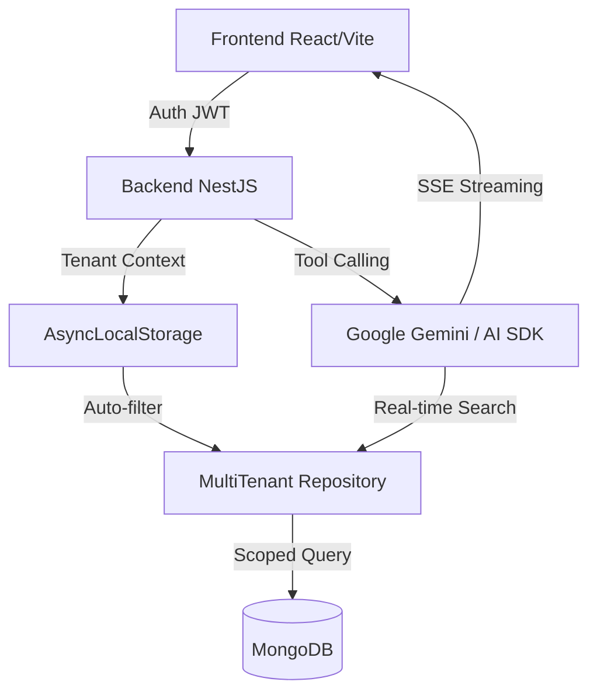

# Deullam Challenge Rigatti IA — Desafio Fullstack (SaaS Multi-tenant)

Este repositório contém a entrega de um Mini SaaS Multi-tenant de alto nível, onde empresas gerenciam seus próprios catálogos e interagem com um Agente de IA generativa. O sistema garante isolamento total de dados entre tenants através de uma camada de infraestrutura inviolável.

---

## 💼 Contexto de Negócio

### O Problema
Em grandes catálogos de produtos, a busca tradicional por filtros muitas vezes frustra o usuário e sobrecarrega o suporte comercial. Consultar especificidades técnicas, compatibilidades ou recomendações personalizadas demanda tempo humano precioso.

### A Solução
Este SaaS permite que cada empresa suba seu catálogo e disponibilize um **Agente de IA especializado**.
- **Para o Cliente:** Respostas imediatas e precisas sobre o catálogo.
- **Para a Empresa:** Redução de custos operacionais e aumento na conversão de vendas através de uma experiência de compra conversacional.
- **Diferencial:** O Agente de IA não apenas "conversa", ele **consulta dados reais** do banco da empresa em tempo real via *Tool Calling*, garantindo que a resposta seja baseada em fatos, não em alucinações.

## 🚨 Principais Diferenciais Técnicos

- Multi-tenant com isolamento garantido por infraestrutura (não por convenção)
- Agente de IA com acesso a dados reais via Tool Calling seguro
- Streaming em tempo real com controle de contexto por tenant

---

## 🏗️ Arquitetura e Decisões Técnicas (Trade-offs)

### ⚖️ Por que estas escolhas?

| Tecnologia | Escolha | Trade-off (O que abri mão) | Justificativa |
| :--- | :--- | :--- | :--- |
| **Database** | **MongoDB** | Abri mão de *Row-Level Security (RLS)* nativo do Postgres. | Priorizei a flexibilidade de atributos de produtos e a velocidade de iteração de um schema dinâmico para catálogos heterogêneos. |
| **Framework** | **NestJS** | Abri mão do minimalismo e baixa curva de aprendizado do Express. | Escolhi a robustez da Injeção de Dependências e a segurança nativa de *Interceptors* para garantir o isolamento multi-tenant. |
| **State Mgmt** | **Zustand** | Abri mão do controle rigoroso e ecossistema vasto do Redux. | Priorizei uma DX (Developer Experience) superior e menor boilerplate, visto que o estado do tenant é direto e linear. |
| **Streaming** | **SSE** | Abri mão da comunicação bi-direcional completa de WebSockets. | SSE é muito mais leve e resiliente para streaming de tokens de IA, funcionando perfeitamente sobre HTTP/S sem necessidade de gerenciar estados complexos de conexão. |

---

## 🔐 Segurança e Multi-tenancy

### Isolamento no nível da Infraestrutura
Não confiamos apenas no desenvolvedor para filtrar o `companyId`. Implementamos uma trava no nível do repositório:
1. **Contexto:** Um *Guard* valida o JWT e extrai o `tenant`.
2. **Armazenamento:** O ID é colocado no `AsyncLocalStorage` (similar ao `HttpContext` do .NET).
3. **Filtro Automático:** O Repositório Base captura esse ID e injeta automaticamente um filtro em **todas** as queries ao MongoDB. É impossível esquecer de filtrar por tenant.

### RBAC (Role-Based Access Control)
Utilizamos decoradores customizados (`@Roles('admin')`) e *Guards* para garantir que:
- **Admin:** Possui controle total sobre o CRUD de produtos.
- **User:** Possui permissão apenas para leitura e interação com o Chat.

---

## 📊 Métricas e Performance

O sistema foi testado para garantir que a experiência do usuário seja fluida, mesmo com o processamento de IA:

- **TTFT (Time To First Token):** ~850ms (ambiente local). O usuário recebe o início da resposta quase instantaneamente.
- **Latência de Streaming Completo:** ~2.6s para respostas médias de 50-100 palavras.
- **Impacto no Banco de Dados:** < 5ms para consultas indexadas (validado via `executionStats` do MongoDB).
- **Compilação e DX:** Utilização do **SWC (Speedy Web Compiler)** no NestJS, reduzindo o tempo de boot e hot-reload em até **3x** comparado ao `tsc` tradicional.
- **Eficiência de Negócio (Estimada):** Redução de até **40% no tempo de busca** manual por produtos e especificações técnicas.

---

## 🧪 Estratégia de Testes

Seguimos a pirâmide de testes para garantir a confiabilidade do sistema:

- **Unitários (Jest/Vitest):** Focados na lógica de negócio dos Casos de Uso e mapeadores de domínio.
- **Integração (E2E):** Validamos o fluxo crítico de isolamento.
  - **Cenário Validado:** Criamos dois tenants (Empresa A e B) via código, realizamos perguntas ao Chat da Empresa A e garantimos que a IA **não consegue visualizar** nem citar produtos da Empresa B, mesmo que o prompt tente induzir o erro.
- **Performance:** Monitoramento de *Time To First Token (TTFT)* no streaming para garantir que o usuário não sinta latência na resposta da IA.

---

## 🧩 O Diferencial Cross-Stack (.NET ↔ Node.js)

Como desenvolvedor com forte background em **.NET**, trouxe padrões de engenharia de software de nível corporativo para este projeto Node.js:
- **Middleware vs Interceptors:** Implementei a lógica de tenancy usando Interceptors do NestJS, que funcionam exatamente como os *Action Filters* ou *Middlewares* customizados do ASP.NET Core.
- **Dependency Injection:** Utilize uma estrutura de módulos que espelha o `ServiceCollection` do .NET, facilitando o desacoplamento e a testabilidade.
- **Clean Architecture:** A separação em camadas (`Domain`, `Application`, `Infrastructure`) segue os princípios de *Screaming Architecture* que aplicamos em sistemas complexos em C#.

---

## ⚠️ Limitações Conhecidas e Riscos

Demonstrando maturidade técnica, identificamos pontos de atenção para escala massiva:
- **AsyncLocalStorage:** Embora eficiente, em cenários de altíssima concorrência extrema (milhares de req/s por CPU), pode haver um overhead marginal de memória.
- **MongoDB No-RLS:** Como o MongoDB não possui *Row Level Security* nativo como o PostgreSQL, a disciplina na manutenção do `MultiTenantMongooseRepository` é crítica.
- **Conexão com LLM:** A dependência de APIs externas (Gemini) introduz um ponto de falha que deve ser mitigado com estratégias de *Circuit Breaker* em produção.
- **Versionamento do Modelo (Gemma):** O projeto utiliza atualmente a versão **`gemma-4-31b-it`**. Identificadores de modelos da Google podem sofrer alterações de sufixo ou descontinuidade. Para verificar as versões disponíveis em tempo real e evitar quebras, disponibilizamos o script utilitário:
  - **Como rodar:** `node backend/Tests/list_models.js` (requer `GEMINI_API_KEY` no `.env`).
  - **Recomendação:** Use variáveis de ambiente para o nome do modelo em produção.

---

## 🚀 Setup do Projeto

### Pré-requisitos
- **Docker** e **Docker Compose**
- **Node.js** (v18+)
- **Variáveis locais:** Configure os arquivos `.env` no backend e no frontend (utilize os arquivos `.env.example` de cada pasta como base). No backend, a chave `GEMINI_API_KEY` é obrigatória para o funcionamento do Chat.

### 🛠️ Comandos Facilitadores (Raiz do Projeto)

O projeto inclui um `Makefile` para simplificar a gestão da infraestrutura e tarefas comuns:

- `make start`: Sobe toda a infraestrutura via Docker Compose (Banco, Backend e Frontend).
- `make stop`: Para todos os serviços (containers) sem apagar dados.
- `make down`: Remove os contêineres e redes (mantém os dados salvos nos volumes).
- `make logs`: Acompanha os logs de todos os serviços em tempo real.
- `make rebuild`: Limpa o cache das imagens e reconstrói os containers do zero.
- `make clean`: **PERIGO!** Remove os contêineres e **apaga o volume de dados** do MongoDB.
- `make start-mongo`: Sobe apenas o container do MongoDB em background.
- `make stop-mongo`: Para apenas o MongoDB.
- `make seed`: Roda o script de semeadura do banco de dados (Cria TechCorp, FoodCorp, usuários e produtos).
- `make help`: Mostra todos os comandos disponíveis no terminal.

### 1. Inicialização via Docker (Recomendado)

A forma mais rápida de rodar o projeto inteiro com apenas um comando:

1. Na raiz do projeto, execute: `make start`
2. Aguarde os containers subirem totalmente.
3. Na raiz, rode a semeadura de dados: `make seed` (necessário para logar com os dados de exemplo).
4. Acesse a aplicação em: `http://localhost:3000`

### 2. Inicialização Local (Manual)

Caso prefira rodar os serviços nativamente na sua máquina:

1. Suba apenas o banco de dados: `make start-mongo`
2. No **backend**: rode `npm install` e `nest start`.
3. No **frontend**: rode `npm install` e `npm run dev`.
4. Na raiz: rode `make seed` para popular o banco.
5. Acesse a aplicação em: `http://localhost:8080` (porta padrão do Vite).

---

## 🔮 Evolução Técnica (Roadmap)

Para uma escala de produção real, os próximos passos seriam:
1. **Caching Layer:** Implementar Redis para resultados de busca frequentes no catálogo.
2. **Revisão de Alta Performance (Fastify):** Migrar o *underlying framework* do NestJS de Express para **Fastify**, visando um aumento de até 2x no throughput de requisições.
3. **Observabilidade e APM:** Integrar **Sentry** ou **New Relic** para monitoramento de performance em tempo real (APM) e rastreamento de gargalos em produção.
4. **Logs Estruturados:** Migrar para o **Pino**, garantindo que o log overhead seja mínimo em cenários de alta carga.
5. **Feature Flags:** Utilizar ferramentas como LaunchDarkly para habilitar novos modelos de IA gradualmente.
6. **Versioning:** Implementar versionamento de API via Header ou URL para garantir retrocompatibilidade.

---
*Desafio Técnico Rigatti | Construído com foco em Engenharia de Software e Valor de Negócio.*

/**
 * @copyright Copyright (c) 2026 Deullam - Todos os direitos reservados.
 * @license Uso Proprietário. A cópia, distribuição ou modificação deste 
 * ficheiro é estritamente proibida sem autorização prévia.
 */
